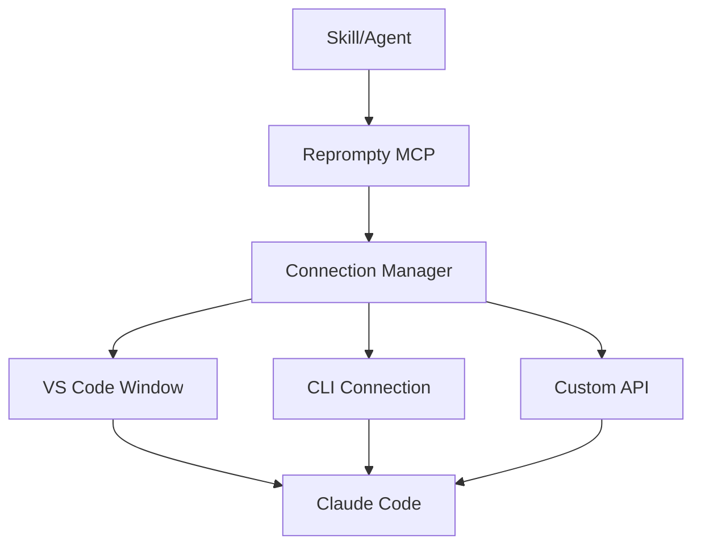

# Reprompty Skill

## Overview

Reprompty is an AI agent orchestration framework that enables multi-window prompt engineering, task automation, and agent team coordination. Built with Bun + Electron + Vite for cross-platform development.

## Architecture



## Connection Types

### 1. VS Code Window (Extension)
- Connects to VS Code window via extension
- Sends prompts in foreground or background
- Uses clipboard + SendKeys or extension IPC

### 2. CLI Connection
- Uses `code --folder-uri` for spawning windows
- Spawns new VS Code instances
- Good for batch operations

### 3. Custom API
- HTTP/WebSocket API connections
- For connecting to external AI services
- Extensible for new connection types

## Connection Management

Similar to Auto Claude MCP, connections are stored in a connection pool and can be added/removed dynamically.

### Connection Types

```typescript
type ConnectionType = 'vscode-window' | 'vscode-cli' | 'http-api' | 'websocket';

interface Connection {
  id: string;
  type: ConnectionType;
  name: string;
  config: VSCodeWindowConfig | VSCodeCLIConfig | HTTPAPIConfig | WebSocketConfig;
  status: 'active' | 'inactive' | 'error';
  createdAt: string;
}

interface VSCodeWindowConfig {
  windowTitle: string;
  method: 'foreground' | 'background'; // foreground uses clipboard+SendKeys, background uses extension IPC
}

interface VSCodeCLIConfig {
  folderPath: string;
  args?: string[];
}

interface HTTPAPIConfig {
  url: string;
  headers?: Record<string, string>;
  auth?: {
    type: 'bearer' | 'basic';
    token: string;
  };
}

interface WebSocketConfig {
  url: string;
  protocols?: string[];
}
```

## MCP Tools

### spawn_window
Spawn a new VS Code window with a project folder.

```typescript
interface SpawnWindowParams {
  folderPath: string;
  windowName?: string;
}
```

### send_prompt
Send a prompt to a specific connection.

```typescript
interface SendPromptParams {
  connectionId: string;
  prompt: string;
  waitForResponse?: boolean;
  timeout?: number;
}
```

### add_connection
Add a new connection to the connection pool.

```typescript
interface AddConnectionParams {
  type: ConnectionType;
  name: string;
  config: VSCodeWindowConfig | VSCodeCLIConfig | HTTPAPIConfig | WebSocketConfig;
}
```

### list_connections
List all available connections.

```typescript
// Returns: Connection[]
```

### remove_connection
Remove a connection from the pool.

```typescript
interface RemoveConnectionParams {
  connectionId: string;
}
```

### daisy_chain
Chain multiple prompts across connections.

```typescript
interface DaisyChainParams {
  prompts: Array<{
    connectionId: string;
    prompt: string;
  }>;
  continueOnError?: boolean;
}
```

### invoke_skill
Invoke a Reprompty skill on a connection.

```typescript
interface InvokeSkillParams {
  connectionId: string;
  skillName: string;
  skillParams?: Record<string, any>;
}
```

## Background Messaging (No Foreground Focus)

Similar to Kilo Code / Roo Code, Reprompty uses **IPC sockets** to send messages in the background without bringing windows to the foreground.

### How It Works

1. **VS Code Extension** runs an IPC server on a Unix socket (or named pipe on Windows)
2. **Reprompty** connects to that socket using an IPC client
3. **Messages are sent** directly to the chat - no window focus needed

### Socket Path Discovery

On Windows, sockets are typically at:
```
\\.\pipe\kilo-ipc-<pid>
\\.\pipe\roo-code-ipc-<pid>
```

The extension listens on `KILO_IPC_SOCKET_PATH` or `ROO_CODE_IPC_SOCKET_PATH` environment variable.

### Foreground vs Background

| Method | Description |
|--------|-------------|
| **background** | Uses IPC socket - message appears in chat without focusing window |
| **foreground** | Uses clipboard + SendKeys - brings window to front (Auto Claude MCP style) |

**Reprompty uses background by default** - this is the key difference from Auto Claude MCP.

## Example Usage (Auto Claude MCP Style)

```typescript
// Add a VS Code window connection (background - uses IPC socket)
await add_connection({
  type: 'vscode-window',
  name: 'claude-code-main',
  config: {
    socketPath: '\\\\.\\pipe\\kilo-ipc-12345',
    method: 'background'
  }
});

// Add another connection (foreground - uses clipboard + SendKeys)
await add_connection({
  type: 'vscode-window',
  name: 'claude-code-agent',
  config: {
    windowTitle: 'Claude Code',
    method: 'foreground'
  }
});

// Send a prompt (appears in chat without focusing window!)
await send_prompt({
  connectionId: 'claude-code-main',
  prompt: 'Create a simple TypeScript function that adds two numbers'
});

// Daisy chain prompts across multiple windows
await daisy_chain({
  prompts: [
    { connectionId: 'claude-code-main', prompt: 'Create a function' },
    { connectionId: 'claude-code-agent', prompt: 'Add tests for the function' }
  ],
  continueOnError: true
});
```

## Platform Abstraction

### Windows Implementation
- Use PowerShell/Win32 APIs for window management
- VS Code CLI: `code --folder-uri`
- Window positioning via Win32 API

### Linux Implementation
- Use wmctrl/xdotool for window management
- VS Code CLI: `code --folder-uri`
- Platform code in `src/platform/windows.ts` / `src/platform/linux.ts`

## Project Structure

```
reprompty/
├── src/
│   ├── main/           # Electron main process
│   │   ├── index.ts
│   │   ├── tray.ts     # System tray
│   │   └── ipc.ts     # IPC handlers
│   ├── preload/       # Preload scripts
│   ├── renderer/      # Vite React app
│   │   ├── App.tsx
│   │   └── components/
│   ├── core/          # Platform-agnostic
│   │   ├── connection-manager.ts
│   │   ├── prompt-engine.ts
│   │   └── task-orchestrator.ts
│   └── platform/      # Platform-specific
│       ├── windows.ts
│       └── linux.ts
├── skills/            # Reprompty skills
├── connections/      # Connection configs
├── MCP.md            # MCP server definition
└── package.json
```

## Usage

### Adding a Connection
```typescript
// Via MCP tool
await add_connection({
  type: 'vscode',
  name: 'my-vscode',
  config: {
    windowTitle: 'Claude Code',
    method: 'background' // or 'foreground'
  }
});
```

### Sending a Prompt
```typescript
await send_prompt({
  connectionId: 'my-vscode',
  prompt: 'Write a hello world in TypeScript'
});
```

### Daisy Chaining
```typescript
await daisy_chain({
  prompts: [
    { connectionId: 'vscode-1', prompt: 'Create a function' },
    { connectionId: 'vscode-2', prompt: 'Add tests for the function' }
  ]
});
```

## XML Prompt Templates

Reprompty supports XML-tagged prompt templates:

```xml
<task>
  <context>
    You are working on a TypeScript project.
  </context>
  <goal>
    Create a new utility function
  </goal>
  <constraints>
    - Must be typed
    - Must include JSDoc
  </constraints>
</task>
```

## Future Considerations

- Skill marketplace for sharing prompt templates
- Multi-agent coordination protocols
- Result aggregation and synthesis
- Workflow visualization
